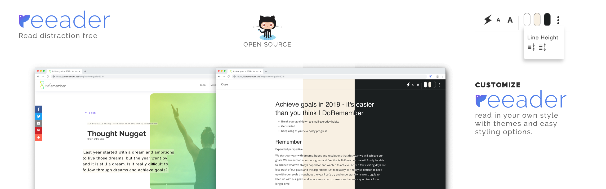
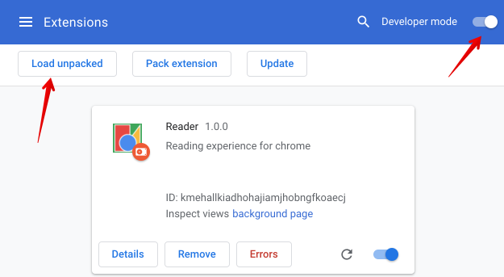

# Google Chrome reader extension

Download the [Reeader extension for Google chrome](https://chrome.google.com/webstore/detail/reeader-minimal-reader-fo/jblbdklppkompnbobkpncbmbjkaeaeah).

## Running extension in development mode

Enable developer mode in Google Chrome and click on 'Load unpacked' and select the extensions folder of the repo. You can now use the extension on any website.

## Development environment setup

Make sure you are in `dev` branch by running `git checkout dev`.

Run `npm install` to start the development server. The source code is in src folder and is powered by React.

### Updating the extension
Run `npm run build` to generate the production code and refresh the extension.
